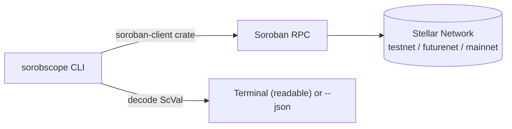

# Architecture

## Overview

`sorobscope` is a single Rust binary. No server, no database, no state of its own between runs — every invocation makes fresh, read-only RPC calls against whichever Stellar network you point it at (testnet by default) and prints decoded output. Its entire value proposition is turning Soroban RPC's raw base64-XDR JSON responses into something a human can read at a glance, or a script can consume via `--json`.

## Design principles

- **Read-only, always.** `sorobscope` never signs or submits a transaction and has no need for a wallet or secret key on any network. This is a deliberate boundary: `stellar-cli` already covers writes well, and adding write capability here would duplicate that tool while introducing key-handling risk this project has no reason to carry. If a future version genuinely needs to write something, that's worth revisiting explicitly — not something to drift into.
- **Decode, don't just relay.** A thin wrapper that pretty-prints raw JSON isn't worth building. Every command's job is turning an `ScVal`/XDR structure into readable text (and an equivalent `--json` structure) — that decoding step is the actual product.
- **Composable by default.** Human-readable output for interactive use, `--json` on every command for piping into `jq` or other tooling. A dev tool that only works interactively is only half a dev tool.

## Known limitations of Soroban RPC itself (not gaps in this tool to "fix" later)

These are real properties of the RPC surface `sorobscope` sits on top of — worth stating plainly in the README too, so nobody mistakes a missing feature here for an oversight:

- **No full storage enumeration.** `getLedgerEntries` requires you to already know and supply the specific ledger key(s) you want — there's no "list every entry this contract has written" RPC call. Genuinely discovering the *complete* set of a contract's storage without already knowing its schema isn't something plain RPC access can do; it's a large part of why third-party indexers (e.g. Mercury) exist in the Stellar ecosystem in the first place. `sorobscope entry` reads one known key at a time by design — see Non-goals below for what a real fix would require.
- **Bounded event/transaction history.** `getEvents` and `getTransaction` are only served from a retained recent window — commonly cited around a week, though the exact figure has shifted across RPC releases, so check a given endpoint's `getHealth` response (`ledgerRetentionWindow`, `oldestLedger`) rather than trusting a fixed number in this doc. `events`/`tx` simply cannot reach further back than whatever that endpoint currently retains.

## Non-goals

- **Signing or submitting transactions** — correctly `stellar-cli`'s job, not this tool's.
- **Full historical storage indexing or enumeration beyond the RPC's retention window** — would require integrating with an indexer (Mercury or similar) or running a long-lived ingestion process of your own from day one. Real, valuable, explicitly out of scope for this repo; flag it as a v2 issue rather than quietly under-delivering on an implied "dump everything" promise.
- **A GUI or web frontend** — this is a terminal tool by design. A future consumer of its `--json` output (a web dashboard, say) is a legitimate idea, but building that frontend isn't this repo's job.
- **Multi-network write-safety tooling** — not applicable; this tool never writes, on any network, ever.
